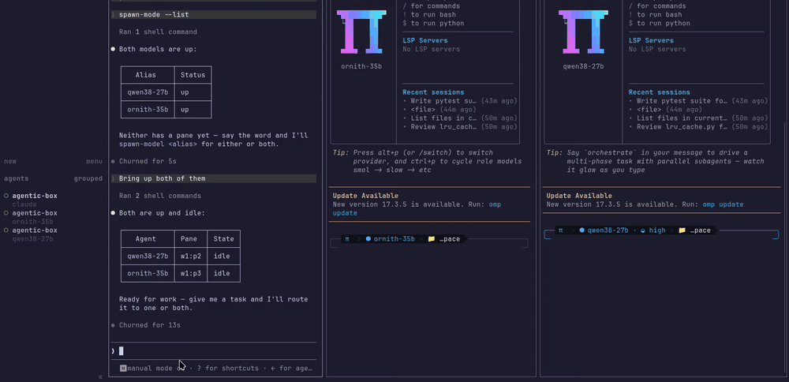

# agentic-box

[](https://github.com/nicoRomeroCuruchet/agentic-box/actions)


An isolated box where **Claude Code drives local model agents**.

It runs in a rootless Docker container, as an unprivileged user, with `herdr` orchestrating
panes. Claude Code starts alone; on demand it launches OMP agents against llama.cpp servers
on your private network, each in its own pane. You talk to Claude; Claude talks to the
models.

```
┌──────────────────────┬──────────────────────┐
│                      │                      │
│     Claude Code      │   model-a (OMP)      │   spawn-model model-a
│                      │   -> host A          │
│   spawn-model ...    ├──────────────────────┤
│   herdr agent prompt │   model-b (OMP)      │   spawn-model model-b
│   herdr agent read   │   -> host B          │
│                      │                      │
└──────────────────────┴──────────────────────┘
    rootless container, unprivileged user, no ssh and no docker inside
```

## Demo

Two local models are up, one per pane, each against a different host. Claude is asked in
plain language to hand one of them a code review, wait for it, and report back — then it
checks the answer against the file itself before passing it on.



## Why this exists

**An agent left running unsupervised with full permissions deleted the home directory of
the account it was running as.** The machine had to be reinstalled.

That is the whole reason for this project. Everything about the setup follows from it:
the agents do not run as you.

An agent on your own account can do anything you can do. Not because it is malicious —
because a wrong path in a cleanup step, an over-broad glob, a command that looked
reasonable in isolation. The blast radius of a mistake is your entire account, and you find
out afterwards.

So the agents run as a **different, unprivileged user**, inside a container:

| Boundary | What it stops |
|---|---|
| A separate host user (`agentic`, uid 1001) | mistakes land in a home with nothing in it |
| Your home at mode 700 | unreadable from the box — not by permissions, not by sudo, not by mounting it in a container |
| No sudo, not in the `docker` group | cannot escalate on the host |
| Rootless Docker | a container escape lands as `agentic`, not as root |
| No `ssh` and no `docker` in the image | cannot hop to other machines or start privileged containers |
| Only three named volumes mounted | nothing of the host filesystem is reachable |

The layering is the point. Any single one of these can be wrong; they are unlikely to all
be wrong at once.

### What it does NOT protect against

Stated plainly, because a security document that only lists its strengths is not one:

- **Outbound network is open.** The container reaches the internet and the whole private
  network by IP. DNS happens to be broken, which is an accident of the rootless network
  setup and not a control — it is trivially bypassed. An agent can exfiltrate anything it
  holds, including its own API token.
- **No resource limits.** No memory cap, no CPU cap, no PID limit. A runaway loop can take
  the whole machine down. **This is the most likely real failure**, and it is not a
  security problem, just an expensive one.
- **The model servers have no authentication.** Anything in the box can send them whatever
  it likes.

None of these are filesystem risks, which is what the box was built for. Know them anyway.

## Why an agent driving other agents

Given the isolation, the second question is why bother orchestrating at all.

Delegating to a local model costs no API tokens and keeps the data on your own network. But
copying and pasting between two terminals makes it unusable in practice. Here Claude drives
the other pane through herdr's socket API: it sends the instruction, waits, reads the
answer and carries on.

---

## The model servers are a separate project

This box is a **client**. It does not serve any model and does not need to know how they
are served — only that something answers `/health` and `/v1/models` in the OpenAI-compatible
format, at a URL listed in `models.conf`.

The setup used here is
**[llamacpp-compose](https://github.com/nicoRomeroCuruchet/llamacpp-compose)**: a
`docker compose` wrapper around llama.cpp that serves a GGUF model on a GPU. That repo is
where the models are configured, where the tuning was measured, and where you go when a
model stops responding. Any other OpenAI-compatible server works too.

---

## Who runs what

This is the first thing to get straight: **three identities are involved**, and confusing
them causes most of the strange errors.

| Identity | What it is | Runs | Privileges |
|---|---|---|---|
| **you** (uid 1000) | your account | `deploy.sh` | sudo, `docker` group |
| **the box user** — `agentic` by default (uid 1001) | isolated host account | `run.sh`, `ctl.sh`, `diag.sh` | **none** — no sudo, not in `docker`, its own rootless daemon |
| **`agentic` inside the container** (uid 1001) | the agents | `claude`, `omp`, `herdr` | none; no `ssh` or `docker` in the image |

The uid matches between host and container on purpose: that way the volumes keep their
ownership and the process inside can write to them.

```bash
./deploy.sh                                        # as YOU (the script calls sudo itself)
sudo -u agentic -H bash ~agentic/agentic-box/run.sh  # as the BOX USER
```

Three rules follow:

- **`deploy.sh` runs without `sudo`.** Run the whole thing as root and `$HOME` becomes
  `/root`, so it looks for the agent binaries in `/root/.local/bin` and fails with an error
  that does not say so. The script refuses to run as root.
- **`run.sh` and `ctl.sh` run with `sudo -u agentic -H`.** The `-H` is not optional:
  without it `$HOME` is still yours and the token file ends up in your own `.config`
  instead of the box user's.
- **The box user cannot read your home**, by any route. That is intentional. Anything that
  has to cross the boundary crosses through `deploy.sh`.

Set `BOX_USER` to use a differently-named account. Paths are derived from `getent passwd`,
never assumed to be `/home/<user>`.

### Lingering, the most fragile part

```bash
sudo loginctl enable-linger agentic     # once
loginctl show-user agentic -p Linger    # must say Linger=yes
```

Without lingering, systemd tears down the box user's session as soon as none of their
sessions are open — which is **always**, because nobody logs in as that user. No session
means no `dockerd`, no socket, and `run.sh` fails with "no rootless docker socket".

It gives no symptom until the first reboot. `deploy.sh` checks it and warns.

---

## Getting started

All of this **from your own account**:

```bash
git clone git@github.com:nicoRomeroCuruchet/agentic-box.git
cd agentic-box

cp models.conf.example models.conf
$EDITOR models.conf              # alias, URL and address of each model

./deploy.sh --run                # copies to the box user's home and launches
```

`deploy.sh` copies the agent binaries from your `~/.local/bin` — **they are not
versioned**, because the Claude Code binary is ~300 MB and GitHub rejects files over
100 MB. As a side effect, the box always runs the same version you do.

**Launch it from a real terminal emulator.** herdr is a full-screen TUI and needs a real
TTY; from inside an agent's shell it renders broken.

### Operation

```bash
sudo -u agentic -H bash ~agentic/agentic-box/ctl.sh status
sudo -u agentic -H bash ~agentic/agentic-box/ctl.sh attach
sudo -u agentic -H bash ~agentic/agentic-box/ctl.sh stop
sudo -u agentic -H bash ~agentic/agentic-box/diag.sh     # token diagnostics
```

`Ctrl+P` `Ctrl+Q` detaches without shutting it down.

---

## Inside: launching models

Claude Code runs these itself, but they work by hand too:

```bash
spawn-model --list          # what exists and whether it is up
spawn-model                 # the first entry in models.conf
spawn-model ornith-35b      # a specific one
close-model ornith-35b
close-model --all
```

You can run **several models at once**, against different hosts.

### How it works, and why this way

Each model lives on a different host, so each OMP agent needs its own
`LLAMA_CPP_BASE_URL`. `herdr agent start` does **not** accept `--env`; `herdr pane split`
**does**. So `spawn-model` puts the environment on the pane and the agent inherits it when
it starts there.

That is the whole idea. It replaces an earlier design where the box had a single backend
pinned with `-e LLAMA_CPP_BASE_URL` at container creation: switching models meant stopping
and recreating the box, because **environment variables are fixed when the container is
created** and attaching does not change them.

`models.conf` is the registry. Each node's address is not optional: the container's
resolver does not know your private network's DNS, so the hostname would not resolve
inside. `run.sh` builds one `--add-host` per entry. TLS still validates, because the
certificate is issued for that same name.

---

## The repo and the deployment are two places

```
this repo                  versioned, editable by you
~agentic/agentic-box       the deployment: another user, mode 750, unreadable from your account
```

That separation **is** the isolation, and it is not something to fix. `deploy.sh` is the
only bridge, which is why it needs sudo. The repo is authoritative: you edit here, you
deploy there.

State lives in three named volumes — `agentic-claude` (login), `agentic-omp` (sessions),
`agentic-work` (workspace) — which survive `stop` and `deploy.sh`. Only `ctl.sh purge`
removes them, and it asks first.

---

## Authentication: by token, never interactive

**OAuth login inside the container does not work.** The code has the form `code#state` and
has to be pasted into a TUI, inside a docker TTY, inside a herdr pane; the paste gets
truncated and you get `OAuth error: Invalid code`. Generate it outside:

```bash
claude setup-token                    # in a normal terminal, as yourself
read -rsp "Paste the token: " TOK && echo
( umask 077; printf 'CLAUDE_CODE_OAUTH_TOKEN=%s\n' "$TOK" > /tmp/tok.env )
unset TOK
sudo -u agentic -H mkdir -p ~agentic/.config
sudo install -o agentic -g agentic -m 600 /tmp/tok.env ~agentic/.config/agentic-box.env
shred -u /tmp/tok.env
```

`run.sh` passes it with `--env-file` rather than `-e`, so the token never shows up in `ps`.

---

## Traps that already cost time

- **Do not pipe the token into `sudo` on stdin.** `sudo ... <<< "TOKEN=..."` makes sudo
  swallow the token as a password attempt and leaves the file empty.
- **`claude auth status` does NOT validate the token.** It returns `loggedIn: true` for any
  non-empty value; it only checks that the variable exists. The only real test is a call:
  `claude -p "reply with only: OK"`. `diag.sh` does exactly that.
- **Environment variables are fixed when the container is CREATED.** If one is running
  without the token, attaching will not add it and re-running the script changes nothing —
  it needs `ctl.sh stop` and a recreate. `run.sh` detects this and stops instead of
  silently attaching you.
- **Every directory mounted as a volume must exist in the image.** When Docker seeds a
  named volume over a non-existent path it creates the directory empty **as root**, and the
  process inside (uid 1001) cannot write. This happened with `~/.claude`.
- **An existing named volume is never re-seeded from the image.** The workspace's
  `CLAUDE.md` used to freeze at the first build's version. Hence the second copy outside the
  volume, which the entrypoint refreshes from.
- **`HERDR_SESSION` is essential.** With a named session herdr puts its socket in
  `~/.config/herdr/sessions/<name>/`, but the CLI looks in `~/.config/herdr/herdr.sock` and
  answers `server_not_running`.
- **`herdr agent read` needs `--source visible`.** The default (`recent`) usually comes back
  empty, which looks like a hung agent.
- **herdr titles panes after their `cwd`.** Everything would be called `workspace` without
  an explicit `herdr pane rename` after creating the pane.
- **The base image release must match the host's.** The agent binaries are copied from the
  host; on an older base the glibc is too old and they will not start.
